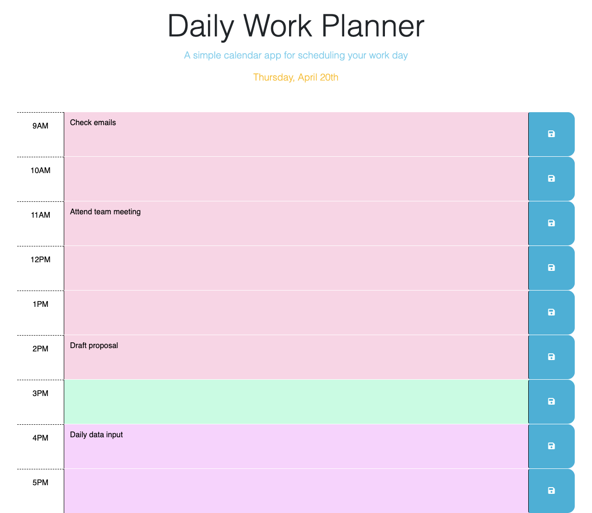

# Daily Work Planner

## Description

This website is designed to serve as a daily planner to save upcoming meetings and events. It has hourly time blocks for a typical work day (9 AM - 5 PM) and each time block can be updated with various tasks to accomplish in that hour. 

## Installation

N/A

## Usage 

When you open up the planner you are able to see a title, subtitle, and the current day and date displayed. When you click on the text area for any time block then you can type as much as needed and click the save button beside the text area to save that task locally. Once saved the task will remain displayed on the page until updated. Each time block is color coded to help you keep track of past events, present events, and future events. 

## Credits 

Utilized [stack overflow](https://stackoverflow.com/questions/75228484/unable-to-correctly-pull-or-display-from-localstorage-using-jquery) to figure out how to create keys using existing ids in local storage. The code created from this reference can be found in my script.js file on lines 46 - 48. 

## License 

Please refer to license in the repo. 

## Deployed Application w/ Screenshot
[Deployed Application](https://pbullock08.github.io/daily-work-planner/)

